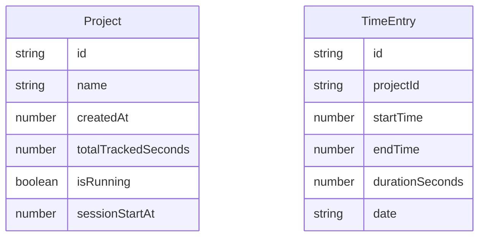

## 1. Architecture Design

```mermaid
flowchart LR
    "Browser" --> "React SPA (Vite + Tailwind)"
    "React SPA" --> "localStorage API"
    "React SPA" --> "IndexedDB (fallback)"
```

The application is a pure frontend Single Page Application. No backend server is required. All data is persisted in the browser's localStorage.

## 2. Technology Description

- **Frontend**: React@18 + TailwindCSS@3 + Vite
- **Initialization Tool**: Vite (`npm create vite@latest`)
- **Backend**: None (fully client-side)
- **Database**: Browser localStorage (JSON serialized)

## 3. Route Definitions

| Route | Purpose |
|-------|---------|
| `/` | Main single-page app — project list, timer controls, add project |

Since this is a single-page application, there is only one view. All interactions happen on the main page.

## 4. Component Tree

```
App
├── Header
│   ├── AppTitle
│   └── TotalTimeSummary
├── AddProjectForm
│   ├── ProjectNameInput
│   └── AddButton
├── ProjectList
│   └── ProjectCard (repeated per project)
│       ├── ProjectName
│       ├── TimerDisplay (HH:MM:SS)
│       ├── TimerControls (Start / Stop)
│       ├── AdjustTimeButton
│       ├── AdjustTimeModal
│       └── DeleteButton
└── DailyHistory
    └── HistoryEntry (repeated)
```

## 6. Data Model

### 6.1 Data Model Definition



### 6.2 Data Storage Schema

```typescript
interface Project {
  id: string;
  name: string;
  createdAt: number; // timestamp
  totalTrackedSeconds: number;
  isRunning: boolean;
  sessionStartAt: number | null; // timestamp when timer was started
}

interface TimeEntry {
  id: string;
  projectId: string;
  startTime: number; // timestamp
  endTime: number | null; // timestamp, null if still running
  durationSeconds: number;
  date: string; // "YYYY-MM-DD" for grouping
}

// Stored in localStorage under key "timeTrackerData"
interface AppData {
  projects: Project[];
  timeEntries: TimeEntry[];
}
```

### 6.3 Data Flow

- On app load: read from localStorage → hydrate React state → render UI
- On timer start: update `project.isRunning = true`, set `project.sessionStartAt = Date.now()`
- On timer stop: calculate elapsed time, create a `TimeEntry`, update `project.totalTrackedSeconds`, save to localStorage
- On time adjust: set `project.sessionStartAt` to user-provided datetime, recalculate running total
- On any state change: immediately persist to localStorage

## 7. Deployment Options

| Platform | Method | Cost |
|----------|--------|------|
| Local | `npm run dev` or open built files | Free |
| GitHub Pages | Push `dist/` to `gh-pages` branch | Free |
| Netlify | Connect Git repo or drag-drop `dist/` | Free (100GB bandwidth) |
| Vercel | Connect Git repo | Free (Hobby tier) |
